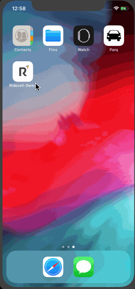

# Ridecell-Demo

## Goal: 
Create as much of the following functionality as possible. Prioritize functionality over perfect code, but do attempt to product code as you would be sending to review. Feel Free to use any third party libraries or tools, including StackOverflow, Google, and asking the team; the goal is to simulate a real-world working environment 

## Instructions: 
Create an application that shows vehicle pins on a map and allows you to view the details of a selected vehicle 

## Criteria: 
-	Vehicles are displayed as annotations on map
-	Zoom to San Francisco by default
-	Display vehicle details when an annotation is selected

### Extra Points
- Implement some type of horizontal scrolls in the vehicle details box that allows you to select another vehicle (pin should also update on the map) 

Note: You'll be provided with a JSON file of Vehicles; no network calls are necessary to fetch the JSON itself 

## User Stores

The following are **Criteria** user stories are complete:

- [x] Vehicles are displayed as annotations on map
- [x] Zoom to San Francisco by default
- [x] Display vehicle details when an annotation is selected

## Video Walkthrough

Here's a walkthrough of implemented requirement:

GIF created with [LiceCap](http://www.cockos.com/licecap/).

## License

Copyright [2019] [Jangey]

Licensed under the Apache License, Version 2.0 (the "License");
you may not use this file except in compliance with the License.
You may obtain a copy of the License at

http://www.apache.org/licenses/LICENSE-2.0

Unless required by applicable law or agreed to in writing, software
distributed under the License is distributed on an "AS IS" BASIS,
WITHOUT WARRANTIES OR CONDITIONS OF ANY KIND, either express or implied.
See the License for the specific language governing permissions and
limitations under the License.
